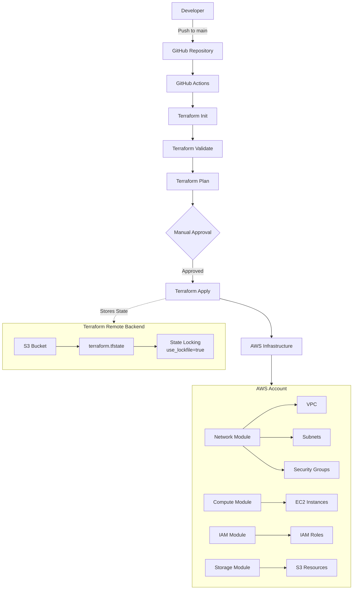
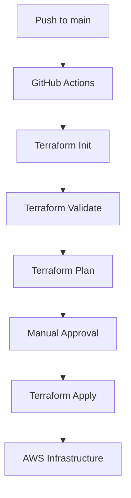

# Enterprise AWS Infrastructure Automation using Terraform

## 📘 Overview

This project demonstrates an enterprise-ready Infrastructure as Code (IaC) implementation on AWS using Terraform. It provisions modular cloud infrastructure, stores Terraform state remotely in Amazon S3 with state locking, and automates deployments through GitHub Actions with manual approval for production changes.

The infrastructure is organized into reusable modules for networking, compute, IAM, and storage, following Terraform best practices. A CI/CD pipeline validates the configuration, generates an execution plan, and deploys changes to AWS through a controlled approval process.

This project showcases production-style Terraform workflows including modular architecture, remote state management, automated deployments, infrastructure lifecycle management, and secure GitHub Actions integration.

---

## 🏗 Architecture

## 🏗️ Architecture


## ✨ Features

- 🏗 **Modular Terraform Architecture**
  - Reusable modules for Network, Compute, IAM, ALB, and Storage.

- ☁️ **AWS Infrastructure Automation**
  - Deploy AWS resources using Infrastructure as Code (IaC).

- 🗄 **Remote Terraform State**
  - Stores state securely in Amazon S3 with state locking (`use_lockfile = true`).

- 🚀 **GitHub Actions CI/CD**
  - Automated Terraform Validate, Plan, and Apply workflow.

- 🔐 **Production Approval Gate**
  - Manual approval required before production deployment.

- 🔄 **Automated Infrastructure Cleanup**
  - Separate GitHub Actions workflow for Terraform Destroy.

- 🔑 **Secure Secret Management**
  - AWS credentials stored securely using GitHub Secrets.

- ✅ **Terraform Best Practices**
  - Version constraints
  - Modular code structure
  - Remote backend
  - Reusable variables
  - Consistent formatting and validation

- 📦 **Enterprise Project Structure**
  - Organized repository with reusable modules and CI/CD automation.

 ## 📂 Repository Structure

| Folder/File          | Purpose                                         |
| -------------------- | ----------------------------------------------- |
| `.github/workflows/` | GitHub Actions deployment and destroy workflows |
| `modules/network/`   | VPC, Subnets, Route Tables, Security Groups     |
| `modules/compute/`   | EC2 Instances                                   |
| `modules/iam/`       | IAM Roles and Instance Profiles                 |
| `modules/storage/`   | Amazon S3 resources                             |
| `backend.tf`         | Remote backend configuration                    |
| `providers.tf`       | AWS provider configuration                      |
| `main.tf`            | Root module                                     |

⚙️ Technologies Used

## ⚙️ Technologies Used

| Category | Technology |
|-----------|------------|
| Infrastructure as Code | Terraform |
| Cloud Platform | Amazon Web Services (AWS) |
| CI/CD | GitHub Actions |
| Version Control | Git & GitHub |
| Remote State | Amazon S3 |
| State Locking | S3 Native Lockfile (`use_lockfile = true`) |
| Programming Language | HCL (HashiCorp Configuration Language) |
| Operating System | Ubuntu (WSL2) |
| IDE | Visual Studio Code |
| AWS CLI | AWS CLI v2 |

## 🚀 CI/CD Workflow

The project uses **GitHub Actions** to automate Terraform deployments and infrastructure lifecycle management.

### Deployment Workflow

## 🚀 CI/CD Workflow



### Destroy Pipeline

The infrastructure can be removed manually using the dedicated **Terraform Destroy** workflow.

```## 🗄 Remote Backend

Terraform state is stored remotely in an Amazon S3 bucket to enable secure and consistent infrastructure management.

### Backend Features

- Amazon S3 Remote State
- State Locking using `use_lockfile = true`
- Versioned Terraform State
- Shared State Management
- Secure State Storage

```
## 🔐 Security

This project follows security best practices for Infrastructure as Code.

- AWS credentials are stored securely using GitHub Secrets.
- Terraform state is stored remotely in Amazon S3.
- Sensitive Terraform files are excluded using `.gitignore`.
- Manual approval is required before production deployment.
- IAM roles are provisioned using Terraform modules.
```hcl
terraform {
  backend "s3" {
    bucket       = "tfbkt5"
    key          = "projects/terraform-demo/terraform.tfstate"
    region       = "ap-south-1"
    encrypt      = true
    use_lockfile = true
  }
}
```